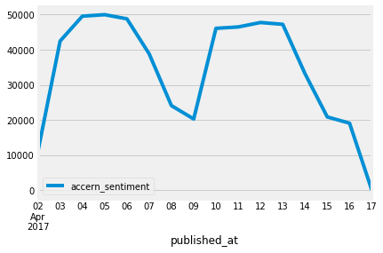

## ACCERN

_NOTE : Analysis has been performed on provided dataset comprised of records from first 2 weeks (2 June to 16 June 2017) with an aim to look for weekly and daily trends._

- story volume

*Hypothesis* : Relatively less relevant stories are published during the weekends. Highest numbers are hit during mid-week with a drop happening again as weekend approaches.

The plot validates the above.

- accern_sentiment (average)

- article_sentiment (average)

- story_sentiment (average)

- first_mention

  2017-04-02    
                False             8533  
                True              2418  
  2017-04-03    
                False            33006  
                True              9459  
  2017-04-04    
                False            41368  
                True              8178  
  2017-04-05    
                False            43661  
                True              6307  
  2017-04-06    
                False            43233  
                True              5558  
  2017-04-07    
                False            34229  
                True              4606  
  2017-04-08    
                False            22566  
                True              1529  
  2017-04-09    
                False            18976  
                True              1314  
  2017-04-10    
                False            41751  
                True              4334  
  2017-04-11    
                False            42248  
                True              4231  
  2017-04-12    
                False            43438  
                True              4303  
  2017-04-13    
                False            43320  
                True              3908  
  2017-04-14    
                False            31379  
                True              1794  
  2017-04-15    
                False            14989  
                True              5885  
  2017-04-16    
                False            14354  
                True              4749
